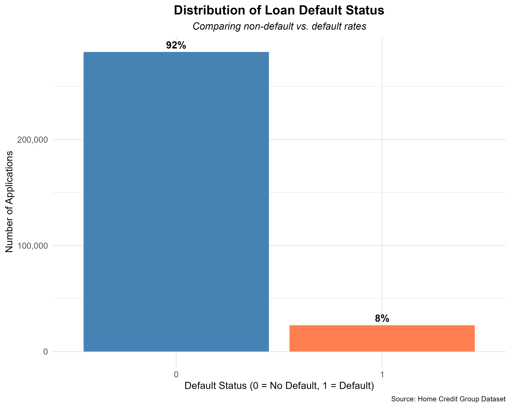

# IS-6812-Project
This is a repo for the practice capstone project completed in Spring 2025 for IS 6812.

## 🌟 Highlights

- Business Problem 
- Solution and Business Value
- Group Contribution
- Difficulties During the Process
- Takeaways from the Project

## 🚩 Business Problem

The Home Credit business problem revolves around improving their ability to predict whether a loan applicant will be able to repay their loan. Home Credit, a company that provides loans to people with limited or no credit history, faces the challenge of accurately assessing the risk of default among their customers. Since their target market often lacks traditional credit scores, Home Credit relies on alternative data sources like demographic information, employment status, and financial behavior to make lending decisions. The goal is to build a predictive model that can better distinguish between low-risk and high-risk applicants, ultimately helping the company approve more good customers while minimizing losses from defaults.

## 💰 Solution and Business Value

Our solution focuses on developing a robust predictive model that uses customer demographics and the bureau data set to more effectively predict default. By carefully engineering features, handling missing data, and selecting powerful classification algorithms, we improve Home Credit’s ability to identify good applicants who might otherwise be overlooked using traditional methods. Using a Random Forest model we improved the ability to predict who will default using factors outside of the normal credit score.

The business value added is 2 main points: first, Home Credit can safely expand their lending portfolio by approving more low-risk customers who would boost revenue; second, by minimizing the number of high-risk approvals, they reduce default rates, protect their financial health, and enhance long-term profitability. Overall, our solution supports smarter, more inclusive lending decisions while strengthening risk management.

## ✍️ Group Contribution

- Feature engineering (Created a few new variables for our analysis) 
- Data cleaning (Dealt with highly correlated variables)
- Modeling (Everyone contributed testing out different models with different hyperparameters)
- Created the presentation in Canva

## 🛑 Difficulties During the Process

One of the main difficulties during the process was the sheer size of the dataset, which created challenges when running complex models that required significant computational power and memory. Additionally, the large number of variables made the feature selection and data preprocessing stages more complicated, requiring extra attention to reduce noise, manage multicollinearity, and ensure that the most meaningful information was captured to improve model performance. These obstacles demanded careful optimization of our workflows to efficiently handle the data and build effective models.

## 🧠 Takeaways from the Project

This project provided valuable experience working with a real-world dataset, highlighting the challenges and skills needed for practical data science. One of the biggest takeaways was realizing just how critical and complex the data cleaning and feature engineering processes are. With large datasets like this, it's essential to think carefully about which variables truly add value to the model and which ones should be removed to avoid noise and overfitting. Effective preparation and thoughtful feature selection made a huge difference in model performance, reinforcing the idea that strong modeling starts long before you actually run the actual models.

